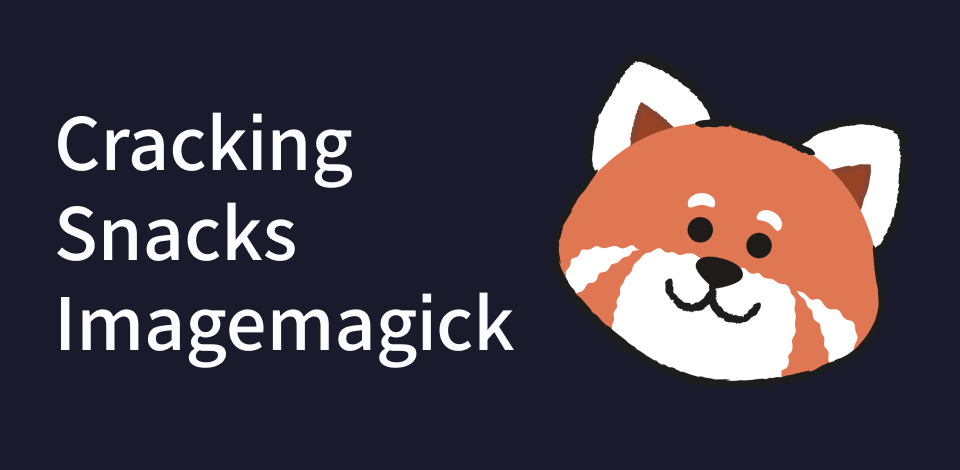

<section>
    
    <h1>Cracking Snacks Imagemagick</h1>
    
Hello hello 👋 
    I'm glad to see you here! This repository is part of series of articles on the automation made for Cracking Snacks. 
    More information can be found on the [Medium article: Part #3: Image creation for Instagram and Whatsapp with Node.js, ImageMagick and Figma](https://medium.com/@Julien_He/b69106b61f80?source=friends_link&sk=699465bc29095fdf011063d7751f395b).
    

</section>